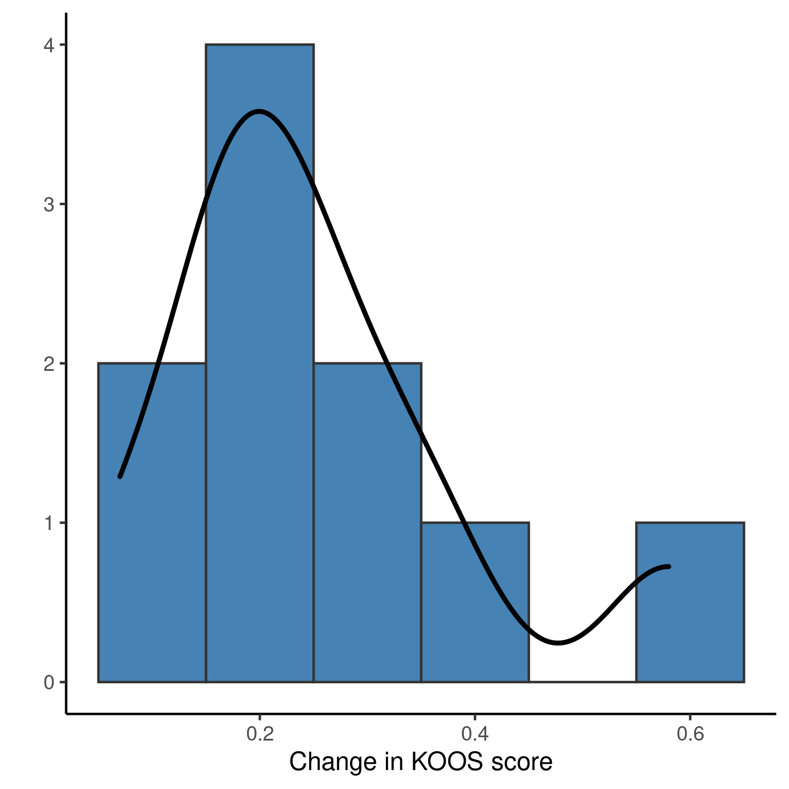
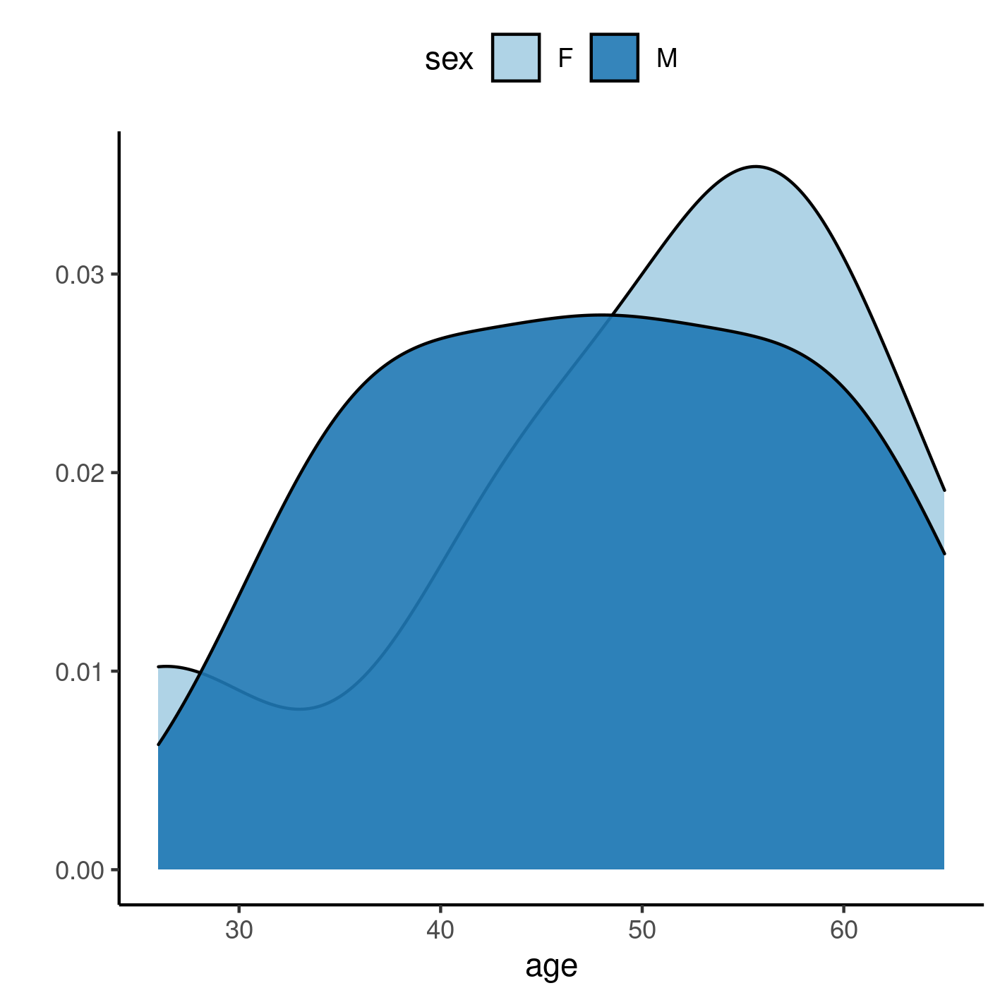

---

\newpage

**[title]**

**Document version**

|Version |Alterations     |
|:-------|:---------------|
|01      |Initial version |

---

# Abbreviations

# Context

## Objectives

## Data reception and cleaning

# Methods

## Study parameters

### Study design

### Inclusion and exclusion criteria

### Exposures

### Outcomes

### Covariates

## Statistical analyses

This analysis was performed using statistical software `R` version 4.1.3.

# Results

## Study population and follow up

Table: **Table 1** caption

| **Baseline characteristics** | **N = 10**  |
|:----------------------------:|:-----------:|
|        __Sex, n (%)__        |             |
|              F               |   7 (70%)   |
|              M               |   3 (30%)   |
|  __Age (years), Mean (SD)__  |   49 (12)   |
|   __VAS score, Mean (SD)__   | 7.70 (2.31) |
|  __KOOS score, Mean (SD)__   | 0.48 (0.14) |

**Figure 1** caption

Table: **Table 2** caption

|**Characteristic**               |  **N = 10**  |
|:--------------------------------|:------------:|
|Change in KOOS score, Mean (SD)  | 0.25 (0.14)  |
|Change in VAS score, Mean (SD)   | -6.10 (1.97) |
|Frequency of use (weekly), n (%) |              |
|0                                |   5 (50%)    |
|1                                |   5 (50%)    |

## Inferential analysis

Table: **Table 3** caption

|**Characteristic**                        | **Beta** |  **95% CI**   | **p-value** |
|:-----------------------------------------|:--------:|:-------------:|:-----------:|
|Crude estimate                            |  -0.08   | -0.29 to 0.13 |    0.420    |
|Controlled for VAS reduction              |  -0.10   | -0.35 to 0.14 |    0.352    |
|Controlled for sex and age                |   0.00   | -0.22 to 0.22 |    0.990    |
|Controlled for VAS reduction, sex and age |  -0.05   | -0.26 to 0.16 |    0.557    |

# Observations and Limitations

# Conclusions

# References

- **SAP-2022-023-AD-v01** -- Analytical Plan for [title]

# Appendix

## Exploratory data analysis

**Figure A1** Distribution of age in the study population.

**Figure A2** Distribution of sex in the study population.

## Modeling strategy

Table: **Table A1** caption

|**Characteristic**        | **Beta** |  **95% CI**   | **p-value** | **Beta** |  **95% CI**   | **p-value** | **Beta** |  **95% CI**   | **p-value** | **Beta** |  **95% CI**   | **p-value** |
|:-------------------------|:--------:|:-------------:|:-----------:|:--------:|:-------------:|:-----------:|:--------:|:-------------:|:-----------:|:--------:|:-------------:|:-----------:|
|Frequency of use (weekly) |          |               |             |          |               |             |          |               |             |          |               |             |
|0                         |    —     |       —       |             |    —     |       —       |             |          |               |             |          |               |             |
|1                         |  -0.08   | -0.29 to 0.13 |    0.420    |  -0.10   | -0.35 to 0.14 |    0.352    |   0.00   | -0.22 to 0.22 |    0.990    |  -0.05   | -0.26 to 0.16 |    0.557    |
|Change in VAS score       |          |               |             |   0.02   | -0.05 to 0.08 |    0.544    |          |               |             |   0.05   | -0.02 to 0.13 |    0.138    |
|Sex                       |          |               |             |          |               |             |          |               |             |          |               |             |
|F                         |          |               |             |          |               |             |          |               |             |          |               |             |
|M                         |          |               |             |          |               |             |  -0.09   | -0.32 to 0.13 |    0.345    |  -0.24   | -0.52 to 0.05 |    0.091    |
|Age (years)               |          |               |             |          |               |             |  -0.01   | -0.02 to 0.00 |    0.098    |  -0.01   | -0.02 to 0.00 |    0.113    |

## Availability

All documents from this consultation were included in the consultant's Portfolio.

<!-- The client has requested that this analysis be kept confidential until a future date, determined by the client. -->
<!-- All documents from this consultation are therefore not published online and only the title and year of the analysis will be included in the consultant's Portfolio. -->
<!-- After the agreed date is reached, the documents will be released. -->

<!-- The client has requested that this analysis be kept confidential. -->
<!-- All documents from this consultation are therefore not published online and only the title and year of the analysis will be included in the consultant's Portfolio. -->

The portfolio is available at:

<https://philsf-biostat.github.io/SAR-2022-023-AD/>

## Analytical dataset

Table A2 shows the structure of the analytical dataset.

| id  | age | sex | pain_pre | koos_pre | outcome | pain_reduc | frequency |
|:---:|:---:|:---:|:--------:|:--------:|:-------:|:----------:|:---------:|
|  1  |     |     |          |          |         |            |           |
|  2  |     |     |          |          |         |            |           |
|  3  |     |     |          |          |         |            |           |
| ... |     |     |          |          |         |            |           |
|  N  |     |     |          |          |         |            |           |

Table: **Table A2** Analytical dataset structure

Due to confidentiality the data-set used in this analysis cannot be shared online in the public version of this report.
