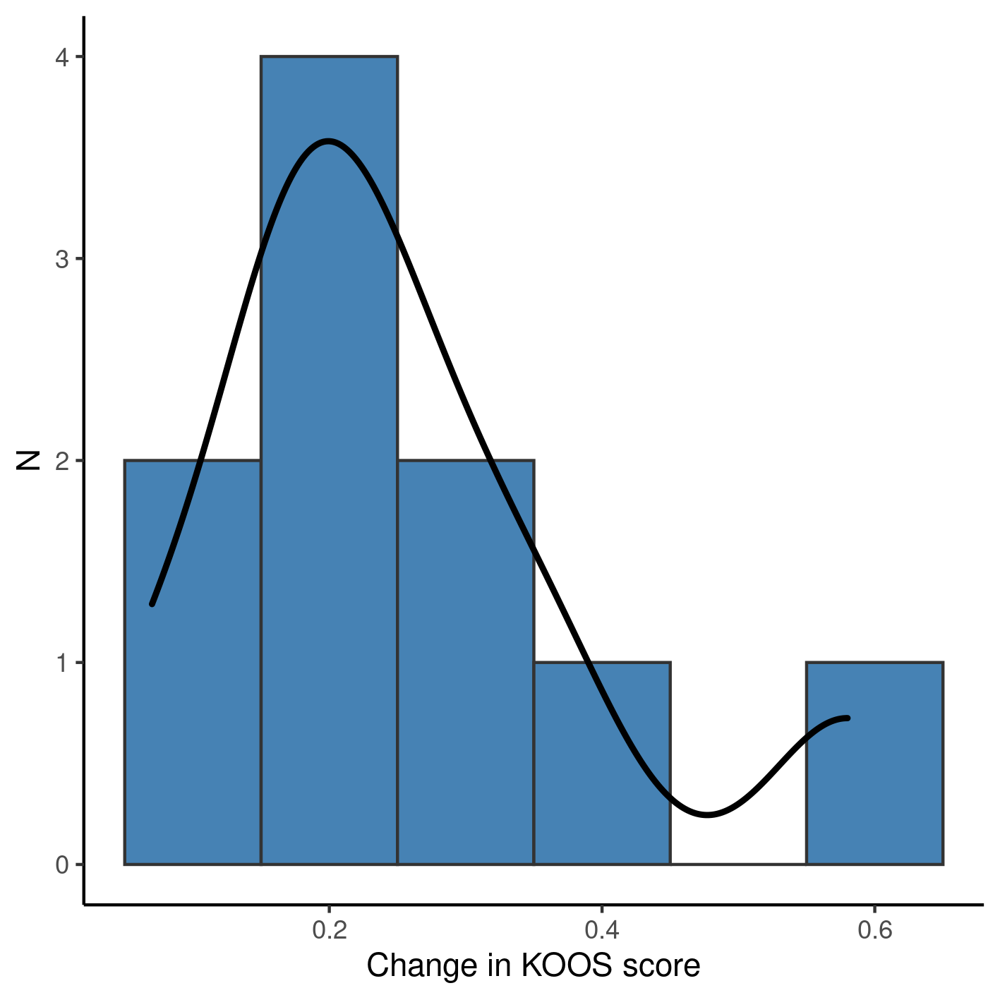
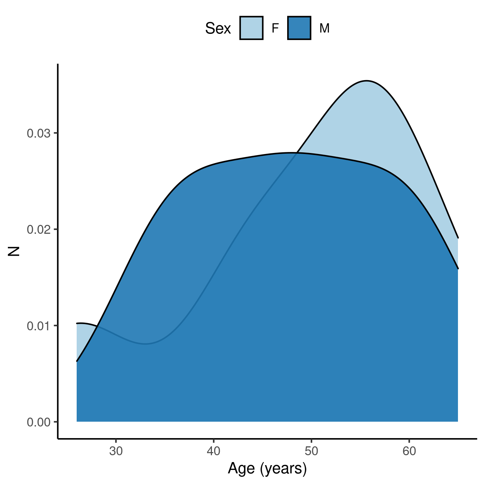
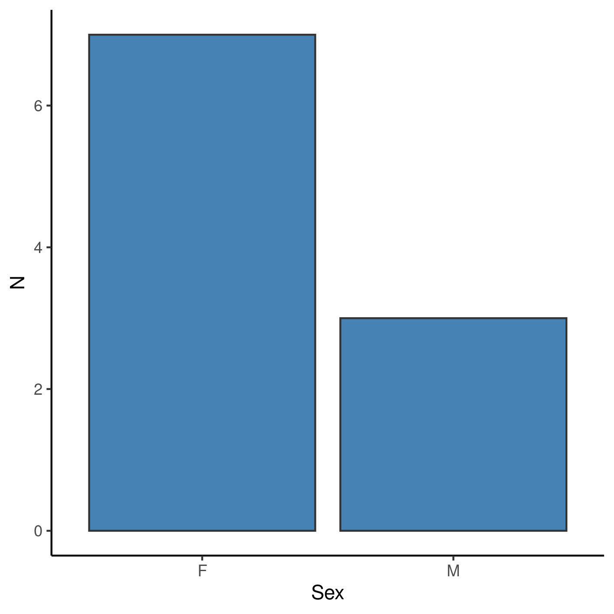

---

\newpage

**Association between KOOS scores and OTC analgesic use in patients using knee-braces**

**Document version**

|Version |Alterations     |
|:-------|:---------------|
|01      |Initial version |

---

# Abbreviations

# Context

## Objectives

## Data reception and cleaning

# Methods

## Study parameters

### Study design

### Inclusion and exclusion criteria

### Exposures

### Outcomes

### Covariates

## Statistical analyses

This analysis was performed using statistical software `R` version 4.1.3.

# Results

## Study population and follow up

Ten participants were followed over the course of a 4-week period in total.
Study sample were on average 49 years old at the start of the study, where 70% were women (Table 1).
Average KOOS score at baseline was 0.48 and average VAS score was 7.7.

Exploratory plots of age and sex distributions in the study population can be seen in Figures A1 and A2 (Appendix).

Table: **Table 1** Demographic and clinical characteristics at baseline.

| **Baseline characteristics** | **N = 10**  |
|:----------------------------:|:-----------:|
|        __Sex, n (%)__        |             |
|              F               |   7 (70%)   |
|              M               |   3 (30%)   |
|  __Age (years), Mean (SD)__  |   49 (12)   |
|   __VAS score, Mean (SD)__   | 7.70 (2.31) |
|  __KOOS score, Mean (SD)__   | 0.48 (0.14) |

In all participants the KOOS score increased during the observation period (Table 2, Figure 1).
Participants showed an average 0.25 increase in KOOS score, with an average 6-point decrease in VAS score.
Over the course of four weeks of observation half of the participants made use of OTC analgesics on a weekly basis.

Table: **Table 2** Clinical characteristics after 4-weeks of observation.

|**Characteristic**               |  **N = 10**  |
|:--------------------------------|:------------:|
|Change in KOOS score, Mean (SD)  | 0.25 (0.14)  |
|Change in VAS score, Mean (SD)   | -6.10 (1.97) |
|Frequency of use (weekly), n (%) |              |
|0                                |   5 (50%)    |
|1                                |   5 (50%)    |

The distribution of the change in KOOS score is markedly bi-modal (Figure 1), where a single participant showed an atypical increase during the same period -- a 26-years old woman exited the study with a 0.58 increase in her KOOS score, having a 6-point decrease in VAS score while taking no weekly OTC analgesics.

**Figure 1** Change in KOOS score after 4 weeks of observation.

## Inferential analysis

We adjusted four linear models to assess the association of analgesic use on the change in KOOS score (Table 3).
The crude estimate given by a simple linear regression (thus not controlling for other variables) indicates that participants using analgesics on weekly basis had a KOOS score 0.08 lower than participants that did not use analgesics.
When controlling for pain reduction as measured by the VAS score this discrepancy increases to a 0.1 decrease, on average.
When the association between KOOS and use of analgesics is controlled for the demographic characteristics the difference in KOOS scores is no longer detectable between different analgesic regimens.

Table: **Table 3** Linear regressions of change in KOOS score associated with use of over the counter analgesics after 4 weeks of observation using a knee brace.

|**Characteristic**                        | **Beta** |  **95% CI**   | **p-value** |
|:-----------------------------------------|:--------:|:-------------:|:-----------:|
|Crude estimate                            |  -0.08   | -0.29 to 0.13 |    0.420    |
|Controlled for VAS reduction              |  -0.10   | -0.35 to 0.14 |    0.352    |
|Controlled for sex and age                |   0.00   | -0.22 to 0.22 |    0.990    |
|Controlled for VAS reduction, sex and age |  -0.05   | -0.26 to 0.16 |    0.557    |

The full model controls for both pain reduction and demographic characteristics, thus giving a more detailed picture of the association.
This estimate means that participants taking OTC analgesics appear to have a slightly lower KOOS score after 4 weeks when compared to those who did not take analgesics.

# Observations and Limitations

# Conclusions

# References

- **SAP-2022-023-AD-v01** -- Analytical Plan for Association between KOOS scores and OTC analgesic use in patients using knee-braces

# Appendix

## Exploratory data analysis

**Figure A1** Distribution of age in the study population.

**Figure A2** Distribution of sex in the study population.

## Modeling strategy

Table: **Table A1** caption

|**Characteristic**        | **Beta** |  **95% CI**   | **p-value** | **Beta** |  **95% CI**   | **p-value** | **Beta** |  **95% CI**   | **p-value** | **Beta** |  **95% CI**   | **p-value** |
|:-------------------------|:--------:|:-------------:|:-----------:|:--------:|:-------------:|:-----------:|:--------:|:-------------:|:-----------:|:--------:|:-------------:|:-----------:|
|Frequency of use (weekly) |          |               |             |          |               |             |          |               |             |          |               |             |
|0                         |    —     |       —       |             |    —     |       —       |             |          |               |             |          |               |             |
|1                         |  -0.08   | -0.29 to 0.13 |    0.420    |  -0.10   | -0.35 to 0.14 |    0.352    |   0.00   | -0.22 to 0.22 |    0.990    |  -0.05   | -0.26 to 0.16 |    0.557    |
|Change in VAS score       |          |               |             |   0.02   | -0.05 to 0.08 |    0.544    |          |               |             |   0.05   | -0.02 to 0.13 |    0.138    |
|Sex                       |          |               |             |          |               |             |          |               |             |          |               |             |
|F                         |          |               |             |          |               |             |          |               |             |          |               |             |
|M                         |          |               |             |          |               |             |  -0.09   | -0.32 to 0.13 |    0.345    |  -0.24   | -0.52 to 0.05 |    0.091    |
|Age (years)               |          |               |             |          |               |             |  -0.01   | -0.02 to 0.00 |    0.098    |  -0.01   | -0.02 to 0.00 |    0.113    |

## Availability

All documents from this consultation were included in the consultant's Portfolio.

<!-- The client has requested that this analysis be kept confidential until a future date, determined by the client. -->
<!-- All documents from this consultation are therefore not published online and only the title and year of the analysis will be included in the consultant's Portfolio. -->
<!-- After the agreed date is reached, the documents will be released. -->

<!-- The client has requested that this analysis be kept confidential. -->
<!-- All documents from this consultation are therefore not published online and only the title and year of the analysis will be included in the consultant's Portfolio. -->

The portfolio is available at:

<https://philsf-biostat.github.io/SAR-2022-023-AD/>

## Analytical dataset

Table A2 shows the structure of the analytical dataset.

| id  | age | sex | pain_pre | koos_pre | outcome | pain_reduc | frequency |
|:---:|:---:|:---:|:--------:|:--------:|:-------:|:----------:|:---------:|
|  1  |     |     |          |          |         |            |           |
|  2  |     |     |          |          |         |            |           |
|  3  |     |     |          |          |         |            |           |
| ... |     |     |          |          |         |            |           |
|  N  |     |     |          |          |         |            |           |

Table: **Table A2** Analytical dataset structure

Due to confidentiality the data-set used in this analysis cannot be shared online in the public version of this report.
